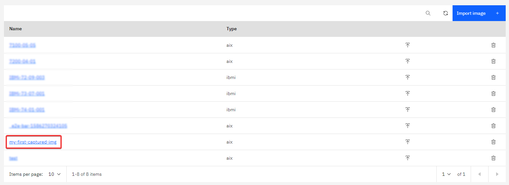

---

copyright:
  years: 2019, 2020

lastupdated: "2020-05-11"

keywords: image catalog, virtual machine capture, cos bucket, export virtual machine, ova

subcollection: power-iaas

---

{:shortdesc: .shortdesc}
{:screen: .screen}
{:codeblock: .codeblock}
{:pre: .pre}
{:tip: .tip}
{:note: .note}
{:preview: .preview}
{:important: .important}
{:deprecated: .deprecated}
{:external: target="_blank" .external}

# Capturing and exporting a virtual machine (VM)
{: #capturing-exporting-vm}

You can capture and export an AIX or IBM i VM instance by using the {{site.data.keyword.powerSys_notm}} user interface or CLI. A VM is captured as **a volume backed image**. The image is stored in new volumes on the storage providers. An image can be exported to an IBM Cloud Object Storage (Cloud Object Storage) bucket. When an image is exported, the volumes of the image are copied and packaged in an Open Virtualization Appliance (OVA) file. The OVA file is compressed by using *gzip* before it gets uploaded to the IBM Cloud Object Storage bucket.
{: shortdesc}

When you capture and export a VM, you can choose the image catalog, Cloud Object Storage, or both as destinations. The image catalog is on the IBM Power storage area network (SAN). IBM Cloud Object Storage is encrypted and dispersed across multiple geographic locations, and accessed over HTTP by using a REST API. This service uses the distributed storage technologies that are provided by the IBM Cloud Object Storage System (formerly Cleversafe). You can always export your image in your image catalog to Cloud Object Storage at a later point. You can also deploy the captured image to create a clone of the VM by using a different network configuration.

A new {{site.data.keyword.powerSysFull}} Job feature is introduced to track long running asynchronous operations like VM capture, image export, and image import. As part of this feature, new version of API and CLI enhancements are introduced for VM capture and image export operations. To view the new API for VM Capture, see [Capture a PVM instance and create a deployable image (version 2)](/apidocs/power-cloud#pcloud-v2-pvminstances-capture-post). To view the new API for image export, see [Add image export job to the jobs queue (version 2)](/apidocs/power-cloud#pcloud-v2-images-export-post). CLI enhancements include changes to the existing [`ibmcloud pi instance-capture`](/docs/power-iaas-cli-plugin?topic=power-iaas-cli-plugin-power-iaas-cli-reference#ibmcloud-pi-instance-capture) command and a new [`ibmcloud pi jobs`](/docs/power-iaas-cli-plugin?topic=power-iaas-cli-plugin-power-iaas-cli-reference#ibmcloud-pi-jobs) command.

The new IBM® Power Systems™ Virtual Server VM Capture, Image Export, and Image Import features are restricted to one operation at a time per IBM® Power Systems™ Virtual Server Service. If one of these operations is submitted successfully, then another new operation (VM Capture, Image Export, and Image Import) cannot be submitted until the previous operation is complete.

You can use the IBM® Power Systems™ Virtual Server legacy REST APIs for VM Capture, Image Export, and Image Import until 1 October 2022. You must plan to transition to the new IBM® Power Systems™ Virtual Server REST APIs or CLI commands before the earlier APIs are withdrawn from service.
{: note}


You are charged different rates based on whether you export to the image catalog or COS.
{: note}

Before you capture an IBM i VM, ensure that any buffer I/O memory is flushed (written) to the disk by running the following command:

```text
CHGASPACT OPTION(*FRCWRT)
```
{: codeblock}

For more information, see [Change ASP Activity (CHGASPACT)](https://www.ibm.com/support/knowledgecenter/ssw_ibm_i_74/cl/chgaspact.htm){: new_window}{: external}.

## Using the Power Systems Virtual Server user interface to capture and export a VM
{: #console-capture-export}

1. Click the **Capture and export** icon in your **Virtual server instances** view. The icon is to the right of the **trash** icon.

2. Choose the volumes that you want to capture and export.

3. Select whether you want to export the volume backed image to the image catalog, COS, or both.

4. Give your captured image a **Name**.

5. *(Optional)* If you decide to export to COS, you are presented with more options:
   1. Select the **Region**.
   2. Provide your [Access and Secret keys](/docs/power-iaas?topic=power-iaas-deploy-custom-image#access-keys).
   3. Select your **Bucket name** and **optional folders**.

6. Click **Capture and export**.

7. If the capture and export is successful, you are presented with a confirmation message.

    If you select large volumes, the export process can take a significantly long period of time.
    {: important}

8. Find your newly exported image by completing either one of the following tasks:

   - If you chose to capture and export your volume backed image to COS, go to your COS bucket.

   - If you chose to capture and export your volume backed image to the image catalog, go to **Boot images**.

    {: caption="Figure 1. Finding your newly captured image in your image catalog" caption-side="bottom"}

9. *(Optional)* If you'd like to export your volume backed image from your image catalog to COS, select it and click the **Capture and export** icon.

## Using the CLI to capture and export a VM
{: #cli-capture-export}

To learn more about using the command-line interface to capture and export a VM, see [IBM Power Systems Virtual Servers CLI Reference](/docs/power-iaas-cli-plugin?topic=power-iaas-cli-plugin-power-iaas-cli-reference#power-iaas-cli-before) and [IBM COS CLI](/docs/cloud-object-storage-cli-plugin?topic=cloud-object-storage-cli-plugin-ic-cos-cli).

1. To capture an AIX or IBM i VM, use the `ibmcloud pi instance-capture` command. You can export it to your image catalog, COS, or both.

    ```text
    ibmcloud pi instance-capture INSTANCE_ID --destination DEST --name NAME [--volumes "VOLUME1 VOLUME2"] [--access-key KEY] [--secret-key KEY] [--region REGION] [--image-path TYPE]
    ```
    {: codeblock}

2. Find your newly exported image by completing either one of the following tasks:

    - To see your newly exported image in the image catalog, use the `ibmcloud pi image-list-catalog` command:

        ```text
        ibmcloud pi image-list-catalog [--long] [--json]
        ```
        {: codeblock}

    - To see your newly exported image in COS, use the `ibmcloud cos list-objects` command:

        ```text
        ibmcloud cos list-objects --bucket BUCKET_NAME [--delimiter DELIMITER] [--encoding-type METHOD] [--prefix PREFIX] [--starting-token TOKEN] [--page-size SIZE] [--max-items NUMBER] [--region REGION] [--json]
        ```
        {: codeblock}
