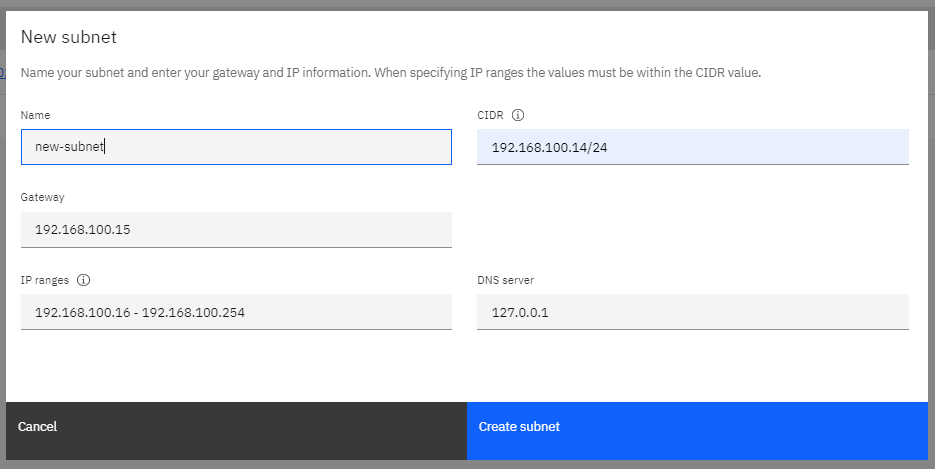

---

copyright:
  years: 2019, 2020

lastupdated: "2020-09-22"

keywords: ssh key, AIX virtual machine, configure ssh key, new virtual server, public ssh key, connecting private subnets, gateway, CIDR, DAL13, WDC04, FRA04, FRA05, DNS

subcollection: power-iaas

---

{:new_window: target="_blank"}
{:shortdesc: .shortdesc}
{:screen: .screen}
{:codeblock: .codeblock}
{:pre: .pre}
{:tip: .tip}
{:note: .note}
{:important: .important}
{:deprecated: .deprecated}
{:external: target="_blank" .external}
{:help: data-hd-content-type='help'}
{:support: data-reuse='support'}

# Configuring and adding a private network subnet
{: #configuring-subnet}
{: help}
{: support}

You can configure a private network subnet when you create a IBM&reg; Power Systems&trade; Virtual Server. You must give your subnet a **Name** and specify a **Classless inter-domain routing (CIDR)**. When you specify a CIDR, the **Gateway**, **IP range**, and **DNS server** are automatically populated. You must use CIDR notation when you choose the IP ranges for your private network subnet. CIDR notation is defined in [RFC 1518](https://tools.ietf.org/html/rfc1518){: external} and [RFC 1519](https://tools.ietf.org/html/rfc1519){: new_window}{: external}.
{: shortdesc}

```shell
<IPv4 address>/number>
```
{: screen}

For example, `192.168.100.14/24` represents the IPv4 address, `192.168.100.14`, and its associated routing prefix `192.168.100.0`, or equivalently, its subnet mask `255.255.255.0` (which has 24 leading 1-bits).

The first IP address is always reserved for the gateway in all data centers. The second and third IP addresses are reserved for gateway high-availability (HA) in only the *WDC04* colo. The subnet address and subnet broadcast address are reserved in both colos.
{: important}

To create a new subnet, complete the following steps:

1. Sign in to the [IBM Cloud Portal](https://cloud.ibm.com){: new_window}{: external}.

2. Select the menu icon and select **Resource List**.

3. Click the arrow next to **Services**.

4. Select the Power Systems Virtual Server service you'd like to assign a subnet.

5. Click **Subnets** in the left navigation pane, then **Add subnet**.

  {: caption="Figure 1. Configuring a new subnet" caption-side="bottom"}

A **DNS server** value of `9.9.9.9` might not be reachable if you don't have a public IP. This can cause the LPAR to hang during startup. Go with the default DNS server value of `127.0.0.1` to avoid this issue. As of now, you can add up to 20 DNS servers. The DNS IP addresses must be separated by commas.

You can also create and configure a private network subnet by using the IBM CLI. Use the following command to create a private network subnet:

```shell
ibmcloud pi network-create-private NETWORK_NAME --cidr-block CIDR --ip-range "startIP-endIP[,startIP-endIP]" [--dns-servers "DNS1 DNS2"] [--gateway GATEWAY] [--json]
```
{: codeblock}

## Networking considerations
{: #networking-considerations}

You must route {{site.data.keyword.powerSys_notm}} private network subnets over {{site.data.keyword.BluDirectLink}} to allow connectivity between {{site.data.keyword.powerSys_notm}} and the {{site.data.keyword.cloud_notm}} network. This step is part of the {{site.data.keyword.cloud_notm}} Direct Link configuration.

In some configurations, private networks communication is needed only between the  {{site.data.keyword.powerSys_notm}} instances and not from Direct Link. You must open a support ticket with [PowerVS support](/docs/power-iaas?topic=power-iaas-getting-help-and-support) to configure the private network in {{site.data.keyword.powerSys_notm}} infrastructure. For example, if you add a subnet *172.10.10.0/24* from user interface, and use case requires communications between the VSIs attached to the subnet, you must open a support ticket providing subnet information displaced in user interface. For more information, see the example below.

| Name          | IP address   | Gateway     | MAC address    | VLAN ID | CIDR       |
| ------------- | ------------ | ----------- | -------------- | ------- | ---------- |
| powerns-net02 | 172.10.10.41 | 172.10.10.1 | ff:68:89:e9:22 | 3001    | 172.10.10.0/26 |
{: Caption="Table 1. Example subnet information displayed in UI" caption-side="bottom"}

You must also make sure that your {{site.data.keyword.powerSys_notm}} has a route to the {{site.data.keyword.cloud_notm}}. The default route might not be set up to route traffic to {{site.data.keyword.cloud_notm}} subnets, which are typically of the form, *10.xx.xx.xx*. Similarly, {{site.data.keyword.cloud_notm}} network-based x86 virtual switch interfaces (VSI) and other hosts might require an IP route to connect to a {{site.data.keyword.powerSys_notm}}.

The gateway for {{site.data.keyword.powerSys_notm}} is also the gateway for the local subnet that is routed to the {{site.data.keyword.cloud_notm}} over {{site.data.keyword.cloud_notm}} Direct Link. The {{site.data.keyword.cloud_notm}} x86 VSI might need a static route to {{site.data.keyword.powerSys_notm}} subnets as well. The gateway for this route is the same as the gateway for the {{site.data.keyword.cloud_notm}} private network.

## Using CIDR notation
{: #cidr-notation}

You must not use an IP range outside of the ranges that are defined by [RFC 1918](https://tools.ietf.org/html/rfc1918){: new_window}{: external} (`10.0.0.0/8`, `172.16.0.0/12`, or `192.168.0.0/16`) for a subnet. The instances that are attached to that subnet might not be able to reach parts of the public internet.

The number after the slash represents the bit length of the subnet mask. As a result, the smaller the number after the slash, the **more** IP addresses you are allocating. The following table lists the number of available addresses in a subnet (based on its specified CIDR block size):

| CIDR block size | Available IP addresses (WDC04) | Available IP addresses (non-WDC04)
| --------------- | ---------------------------- |---------------------------
|      /22        |        1019                  |          1021
|      /23        |         507                  |          509
|      /24        |         251                  |          253
|      /25        |         123                  |          125
|      /26        |          59                  |           61
|      /27        |          27                  |           29
|      /28        |          11                  |           13
{: Caption="Table 2. Understanding CIDR notation caption" caption-side="bottom"}