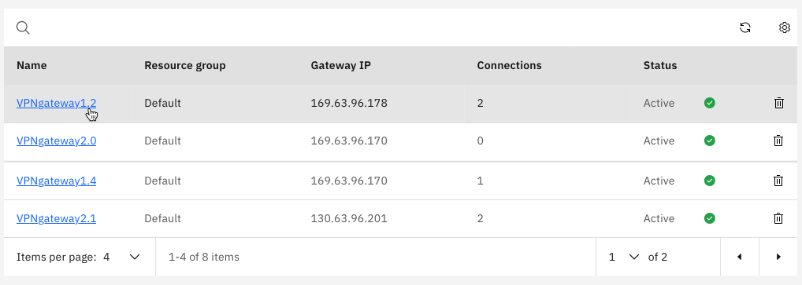
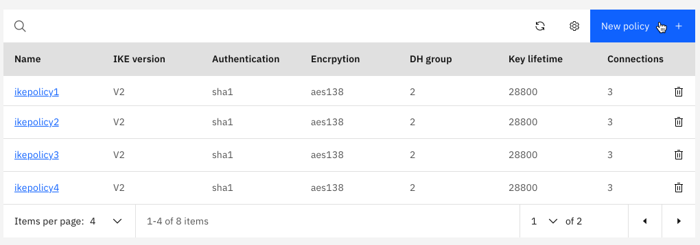

---

copyright:
  years: 2019, 2020

lastupdated: "2020-04-27"

keywords: vpn, connections ike, ipsec, internet key exchange, vpn, peer subnet, local subnet, gateway address

subcollection: power-iaas

---

{:new_window: target="_blank"}
{:shortdesc: .shortdesc}
{:screen: .screen}
{:codeblock: .codeblock}
{:pre: .pre}
{:tip: .tip}
{:note: .note}
{:preview: .preview}
{:important: .important}
{:deprecated: .deprecated}
{:external: target="_blank" .external}

# Creating VPN connections
{: #creating-vpn-connections}

Learn how to create a VPN connection within the {{site.data.keyword.powerSysShort}} service.

1. Go to **VPN connections** and click **New VPN connection**.

    {: caption="Figure 1. Creating a new VPN connection" caption-side="bottom"}

2. Under **New VPN connection**, complete the following fields:

    To attach a local subnet, you must first go to **Subnet** and create one.
    {: note}

   - **Connection name**: Enter a name for the connection, such as `vpn-connection`.
   - **Peer gateway address**: Specify the IP address of the VPN gateway for the external network.
   - **Preshared key**: Specify the authentication key of the VPN gateway for the external network.
   - **Local subnets**: Specify one or more local subnets you want to connect through the VPN tunnel.
   - **Peer subnets**: Specify one or more subnets in the external network you want to connect through the VPN tunnel.

3. To configure how the cloud gateway sends messages to check that the peer gateway is active, specify the following information in the **Dead peer detection** section:

   - **Dead peer detection action**: The action to take if a peer gateway stops responding. For example, select **Restart** if you want the gateway to immediately renegotiate the connection.
   - **Interval**: How often to check that the peer gateway is active. By default, messages are sent every 2 seconds.
   - **Timeout**: How long to wait for a response from the peer gateway. By default, a peer gateway is no longer considered active if a response isn't received within 10 seconds.

4. (*Optional*) Specify the Internet Key Exchange (IKE) and Internet Protocol Security (IPsec) parameters to use for the **phase 1** and **phase 2** negotiation of the connection.

   - Select **Auto** if you want the cloud gateway to try to automatically establish the connection.
   - Select or create custom policies if you need to enforce particular security requirements. Also, select this option if the VPN gateway for the external network doesn't support the security proposals that are tried by auto-negotiation.

    The IKE and IPsec security parameters that you specify for the connection must be the same parameters that are set on the gateway for the network outside your VPC.
    {: important}

5. After you create a VPN connection, you'll see it in the **VPN connections** table. To edit your existing VPN configuration, click the VPN connection name followed by **Edit configuration**.

{: caption="Figure 2. VPN connection details" caption-side="bottom"}

## VPN gateways
{: #vpn-gateways}

To see a list of your VPN gateways, see **VPN gateways**. Here, you can see your VPN gateway's **Resource group**, **Gateway IP**, **Connections**, and **Status**.

{: caption="Figure 3. VPN gateways" caption-side="bottom"}

If you click your VPN gateway, you are taken to its details. The VPN gateway details pane contains more specific information, including its ID, creation date, and location.

{: caption="Figure 4. VPN gateway details" caption-side="bottom"}

## IKE policies
{: #ike-policies}

You can see a list of your IKE policies by going to **IKE policies**. Here, you can add a policy if needed.

{: caption="Figure 5. IKE policies" caption-side="bottom"}

To modify an existing IKE policy, click the policy name followed by **Edit policy**. Each IKE policy consists of the following configuration parameters:

- **Name**: IKE policy name
- **IKE version**: *IKEv1* and *IKEv2*
- **Authentication**: `md5`, `sha1`, `sha256`
- **Encryption**: `3des`, `aes128`, `aes256`
- **Diffie-Hellman (DH) group**: 2, 5, 14
- **Key lifetime**: The amount of time your key lasts

{: caption="Figure 6. IKE policy details" caption-side="bottom"}

## IPsec policies
{: #ipsec-gateways}

You can see a list of your IPsec policies by going to **IPsec policies**. Here, you can add a new policy if needed.

  {: caption="Figure 7. IPsec policies" caption-side="bottom"}

To modify an existing IPsec policy, click the policy name followed by **Edit policy**. Each IPsec policy consists of the following configuration parameters:

- **Name**: IPsec policy name
- **PFS**: `On` or `Off`
- **Authentication**: `md5`, `sha1`, `sha256`
- **Encryption**: `3des`, `aes128`, `aes256`
- **Diffie-Hellman (DH) group**: 2, 5, 14
- **Key lifetime**: The amount of time your key lasts

  {: caption="Figure 8. IPsec details" caption-side="bottom"}
