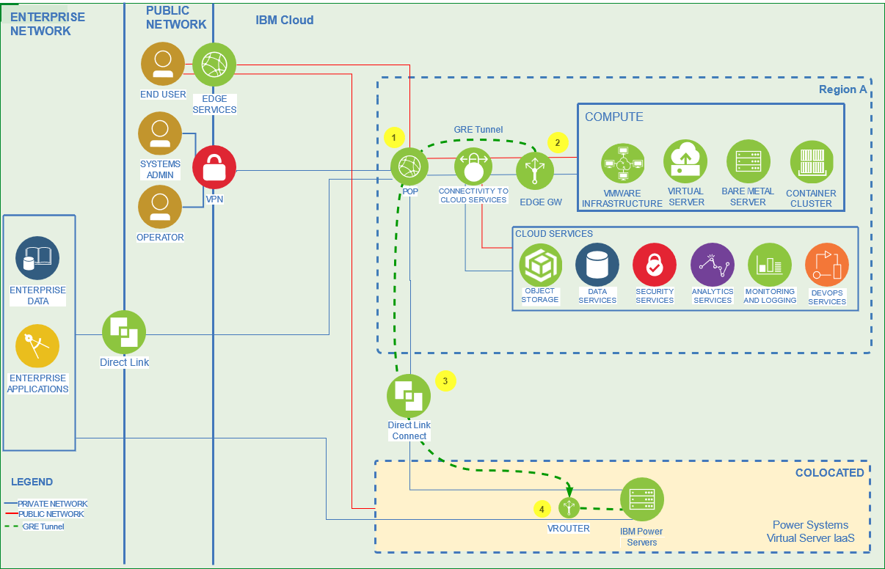
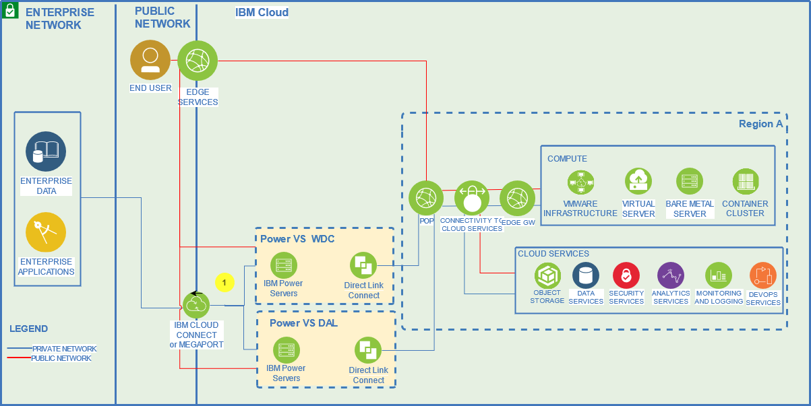
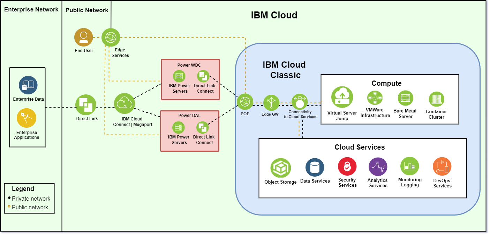
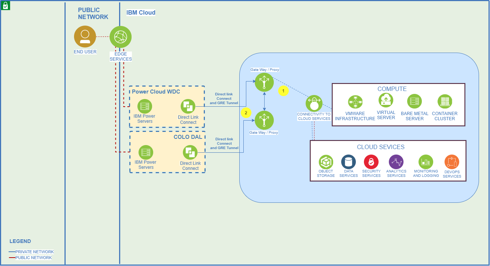

---

copyright:
  years: 2019, 2021

lastupdated: "2021-05-10"

keywords: networking diagrams, network architecture, private ssl, private ipsec, direct link, colocation, data center, cloud connect, megaport

subcollection: power-iaas

---

{:new_window: target="_blank"}
{:shortdesc: .shortdesc}
{:screen: .screen}
{:codeblock: .codeblock}
{:pre: .pre}
{:tip: .tip}
{:note: .note}
{:important: .important}
{:deprecated: .deprecated}
{:external: target="_blank" .external}

# Network architecture diagrams
{: #network-reference-architecture}

Use the following diagrams to understand the {{site.data.keyword.powerSysShort}} network architecture. This is not an exhaustive list of {{site.data.keyword.powerSys_notm}} connection methods.
{: shortdesc}

IBM Cloud Connect is only available to IBM clients within the US. IBM clients can always contact Megaport connectivity services directly to procure their services.
{: important}

## Private SSL connection
{: #private-ssl}

You can use the **IBM Cloud SSL VPN** service to connect to your existing IBM Cloud network.

Use the following network architecture for environment management by using the public network. This model is not ideal for production workloads.

1. Connect to the IBM Cloud network through public network by using secure socket layer (SSL) virtual private network (VPN) service.

2. In the IBM Cloud network, use an IBM Cloud virtual server instance as a jump server. Jump server can be used as login server or as a proxy server.

3. Connect the Power Systems Virtual Server instance to the IBM Cloud network by using the Direct Link Connect service.

{: caption="Figure 1. Power Systems Virtual Server private SSL connection" caption-side="bottom"}

## Private IPsec connection
{: #private-ipsec}

You can use IBM Cloud Virtual Router Appliance (VRA) for site-to-site IPSec VPN connectivity. In this networking scenario, a Generic Routing Encapsulation (GRE) tunnel exists between a virtual router in the Power IaaS and the Edge Gateway (VRA) inside the IBM Cloud. For a tutorial on site-to-site VPN connectivity, see [IBM Power Virtual Server Virtual Private Network Connectivity](https://cloud.ibm.com/media/docs/downloads/power-iaas-tutorials/PowerVS_VPN_Tutorial_v1.pdf){: new_window}{: external}.

Use the following network architecture for environment management by using the public network. This model is not ideal for production workloads. You can implement this model for proof-of-concept, development, and test purposes.

1. Connect your enterprise network to the IBM Cloud network by using the [IBM Cloud IPSec VPN service](/docs/iaas-vpn?topic=iaas-vpn-setup-ipsec-vpn).

2. In the IBM Cloud network, use an Edge Gateway device to connect to the Power Systems Virtual Server location. You must use an Edge Gateway (Vyatta or vSRX) router-based IPSec VPN. Optionally, you can use the IBM Cloud IPsec service.

3. [Configure the GRE service](/docs/power-iaas?topic=power-iaas-configuring-power#gre-tunneling) on the IBM Power Systems Virtual Server network to establish a GRE tunnel and to enable bring-your-own-IP address (BYOIP) to the Power Systems Virtual Server environment. A VRA or equivalent is required in IBM Cloud because you cannot use a VPN connection to directly connect to the Power Systems Virtual Server instance.

   For a tutorial on a site-to-site IPSec VPN by using a VRA, see [VPN into a secure private network](/docs/virtual-router-appliance?topic=solution-tutorials-configuring-IPSEC-VPN ).
    {: note}

4. Connect the Power Systems Virtual Server instance to the IBM Cloud network by using the Direct Link Connect service.

{: caption="Figure 2. Power Systems Virtual Server private IPSec connection" caption-side="bottom"}

## Power IaaS Connectivity from Customer Data Center using IBM Cloud Direct Link
{: #cloud-to-poweriaas}

You can connect to the IBM Cloud Power environment by using **IBM Cloud Direct Link**. Any [Direct Link](/docs/dl?topic=dl-dl-about#overview-of-direct-link-offerings) offering can be used for this connectivity.

1. In the IBM Cloud network, use an Edge Gateway device to connect and to control routing between IBM Cloud Network and the Customer Enterprise Data Center Network.

2. Connect the IBM Power Systems Virtual Server by using Direct Link Connect to the IBM Cloud network. For more information see, [Direct Link](/docs/dl?topic=dl-dl-about#overview-of-direct-link-offerings) and [Cloud connections](/docs/power-iaas?topic=power-iaas-managing-cloud-connections).

3. [Configure the GRE service](/docs/power-iaas?topic=power-iaas-configuring-power#gre-tunneling) on the IBM Power Systems Virtual Server network to establish a GRE tunnel to the Power Server environment and to enable the bring-your-own-IP address (BYOIP) feature. A VRA or equivalent is required in IBM Cloud.

{: caption="Figure 4. Power Systems Virtual Server data center connection" caption-side="bottom"}

<!--## IBM Power IaaS locations connectivity by using IBM Cloud Connect or Megaport
{: #onprem-to-poweriaas}

You can connect your IBM Power on-premises environment to a Power IaaS by using **IBM Cloud Connect or Megaport** as shown in the following diagram.

  {: caption="Figure 5. IBM Power on-premises environment to Power IaaS connection by using IBM Cloud Connect or Megaport" caption-side="bottom"}-->

## IBM Power IaaS locations connectivity by using IBM Cloud Connect or Megaport
{: #poweriaas-to-poweriaas-megaport}

You can connect multiple Power Systems Virtual Server locations by using **IBM Cloud Connect** or **Megaport**. IBM Cloud Connect is a managed network service that uses Megaport services. This service is available only in the United States. You can also use MegaPort or Cloud Connect to connect Power IaaS directly from your Enterprise Data Center.

When connecting a Power IaaS Loaction-1 to Power IaaS Location-2 by using Megaport, you might need a [Megaport Cloud Router (MCR)](https://knowledgebase.megaport.com/megaport-cloud-router/what-is-mcr/){: new_window}{: external} unless network connectivity is through a customer router. <!--If you want to route to more than one location from your colo, you must use an MCR (unless your router can perform this function). In some cases, an MCR is not required. For example, you only need one Megaport port open to perform a data replication between *DAL13* and *WDC04*--> Consult an IBM Cloud Connect or Megaport representative for specific network requirements.

Use the following network architecture for connectivity between multiple Power Systems Virtual Server locations.

1. When you have your VMs in more than one Power Systems Virtual Server locations that are provisioned for resiliency, PVS-Location1 to PVS-Location2 connectivity can occur outside of IBM Cloud network. You can establish connectivity between the Power Systems Virtual Server locations by using Megaport or IBM Cloud Connect (available only in the United States).

2. IBM Cloud Connect must be used when you want a fully managed service for connectivity between Power Systems Virtual Server locations. IBM Cloud Connect provides connectivity not only to IBM Cloud or the Power Systems Virtual Server locations, but also provides fully managed connectivity in multi-cloud scenarios. <!--Although you are responsible for the final connectivity, IBM Network Services can also provide this as a service with Cloud Connect.-->

{: caption="Figure 6. IBM Power IaaS location connectivity by using Direct Link, IBM Cloud Connect, or Megaport" caption-side="bottom"}

<!-- ## IBM Power colo to colo connection using GRE tunneling
{: #colo-to-colo-gre}

You can connect a colo to a colo by using **Direct Link** and GRE tunnels.

  {: caption="Figure 7. Power Systems Virtual Server Colo to Colo (GRE Tunneling)" caption-side="bottom"} -->

## IBM Power IaaS locations connectivity by using IBM Cloud network backbone and proxy routers
{: #dual-poweriaas}

You can connect to multiple Power Systems Virtual Server locations from your on-premises environment after creating a Direct-Link connection and by using IBM Cloud Connect or Megaport.

Use the following network architecture for connectivity between multiple Power Systems Virtual Server locations when high bandwidth is not required and high or variable latency can be tolerated. You are responsible for deploying the configuration including Direct Link Connect services, GRE tunnels, proxies, gateways, and so on. Infrastructure must be sized appropriately for the required performance.

1. When your VMs are provisioned in more than one Power Systems Virtual Server locations for resiliency, PVS-Location1 to PVS-Location2 connectivity can occur through the IBM Cloud network by using proxy servers. You also need GRE tunnels for the transit.

2. Configure Direct Link Connect with [GRE configuration](/docs/power-iaas?topic=power-iaas-configuring-power#gre-tunneling) at both the Power Systems Virtual Server locations for connectivity with the IBM Cloud network. Network bandwidth and latency depend on the Direct Link Connect service, proxy gateway, and IBM Cloud network.

In Power Systems Virtual Server locations connectivity by using network backbone, only one gateway or proxy is sufficient if Direct Link connections are configured with Global Routing. You must test your configuration before using this network architecture for production use.
{: .note}

{: caption="Figure 8. IBM Power IaaS locations connectivity by using IBM Cloud network backbone and proxy routers" caption-side="bottom"}

