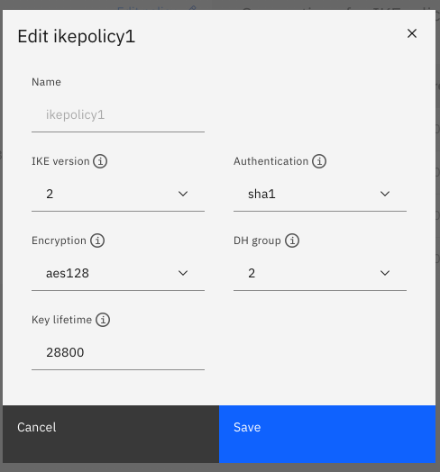
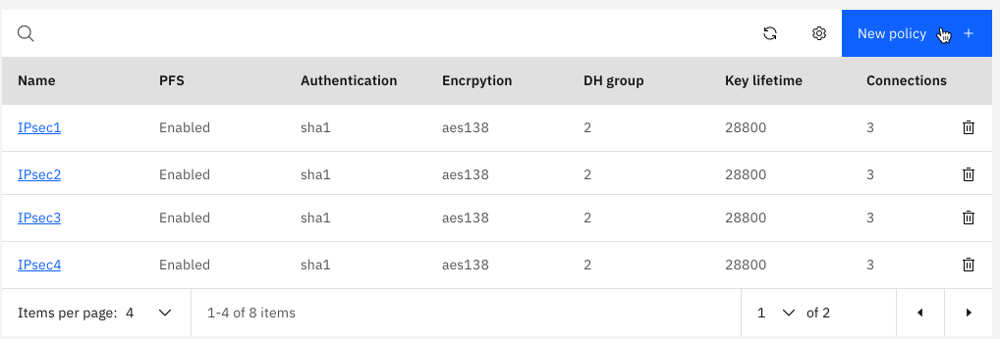
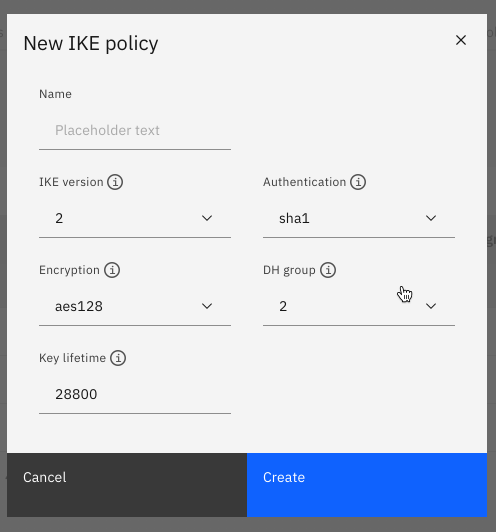

---

copyright:
  years: 2019, 2020

lastupdated: "2020-04-14"

keywords: network vpnaas, ipsec, internet key exchange, juniper, cisco, strongswan

subcollection: power-iaas

---

{:new_window: target="_blank"}
{:shortdesc: .shortdesc}
{:screen: .screen}
{:codeblock: .codeblock}
{:pre: .pre}
{:tip: .tip}
{:note: .note}
{:preview: .preview}
{:important: .important}
{:deprecated: .deprecated}
{:external: target="_blank" .external}

# Understanding virtual private networks (VPNs)
{: #understanding-vpn}

With the {{site.data.keyword.powerSysShort}} service's virtual private network (VPN), you can connect an on-premises VPN gateway to an {{site.data.keyword.cloud}} VPN (that was created within a {{site.data.keyword.powerSys_notm}} VPN gateway.
{: shortdesc}

The {{site.data.keyword.powerSys_notm}} infrastructure consists of subnets and virtual server instances (VSIs). The {{site.data.keyword.powerSys_notm}} VPN gateway establishes an IPsec site-to-site link to an on-premises VPN gatway.

The IPSec and the Internet Key Exchange (IKE) protocols are proven open standards for secure communication.
{: note}

There are many popular on-premises VPN solutions that are available for site-to-site gateways. You can get IPsec VPN solutions from companies like Cisco and Juniper or choose an open source IPsec-based VPN solution like strongSwan.

In short, you can use a VPN to:

- connect your on-premises systems to services and workloads running in the {{site.data.keyword.cloud_notm}}.
- ensure private and low-cost connectivity to {{site.data.keyword.cloud_notm}} services.
- connect your cloud-based systems to services and workloads running on-premises.

## VPN-as-a-service (VPNaaS)
{: #understanding-vpn}

To request and configure your VPN, complete the following steps:

The {{site.data.keyword.powerSys_notm}} VPNaaS offering is currently in **beta**. You must open up a ticket to activate this offering. The VPNaaS offering will be supported in the user interface (UI) and command line interface (CLI) when it is officially released.
{: preview}

1. You can use VPNaaS with your existing VSIs and private networks. If you haven't created at least one VSI or private network, see [Creating a Power Systems Virtual Server](/docs/infrastructure/power-iaas?topic=power-iaas-creating-power-virtual-server) and [Configuring and adding a private network subnet](/docs/infrastructure/power-iaas?topic=power-iaas-configuring-subnet).

2. Create a service case against the {{site.data.keyword.powerSys_notm}} team to request a VPN connection. Please follow the service ticket process described at [Getting help and support](/docs/infrastructure/power-iaas?topic=power-iaas-getting-help-and-support).

3. Subject should be like “Power VS VPNaaS Beta Setup: Loc: ….   “
4. In the case description, please provide the following information for your (customer) network.
    a. Gateway IP:
    b. Connection Name:
    c. Subnets to be reached at customer location in CIDR notation
    d. Subnets to be reached in Power VS environment in CIDR form.

5	Once Power VS team gets the request, Power VS side of the VPN will be configured, and the following information will be provided for cnfiguring the customer side. 
a	Power VS Gateway IP:
b	Power VS IPSec Policy
c	Shared secret key will be provided to the customer authorized recipient.
d	Routes to customers on-prem subnets will be added and customers Power VS subnets will be reachable via VPN.

6.	Power VS team will test connectivity and provide results in the ticket. 

7.	When the customer confirms proper operation of the VPN, the case will be closed.

<!-- 
  {: caption="Figure x. Edit Ikepolicy" caption-side="bottom"}

  {: caption="Figure x. Edit IPsec" caption-side="bottom"}

  {: caption="Figure x. IKE policies" caption-side="bottom"}

  {: caption="Figure x. IKE policy details" caption-side="bottom"}

  {: caption="Figure x. IPsec details" caption-side="bottom"}

  {: caption="Figure x. IKEpolicy details" caption-side="bottom"}

  {: caption="Figure x. IPsec details" caption-side="bottom"}

  {: caption="Figure x. IPsec policies" caption-side="bottom"}

  {: caption="Figure x. New IPsec policy" caption-side="bottom"}

  {: caption="Figure x. VPN connection details" caption-side="bottom"}

  {: caption="Figure x. VPN gateway details" caption-side="bottom"}

  {: caption="Figure x. VPN gateway details" caption-side="bottom"}

  [Edit dead peer detection](./images/console-edit-dead-connection.png "Edit dead peer detection"){: caption="Figure x. Edit dead peer detection" caption-side="bottom"} -->
